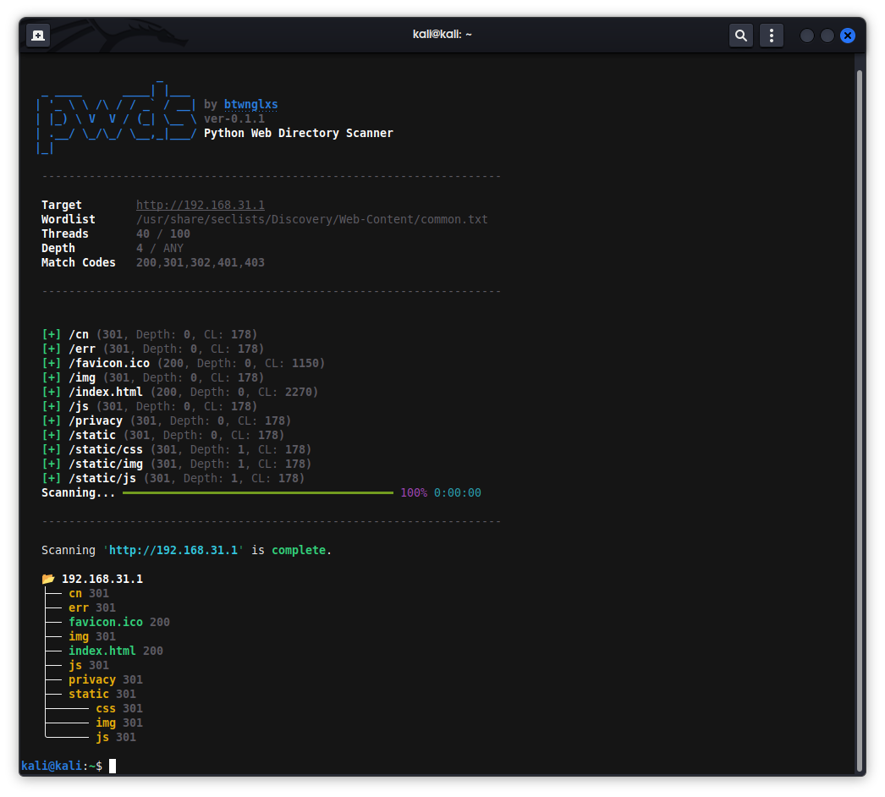

# Python Web Directory Scanner (pwds)

Python Web Directory Scanner (pwds) — это многопоточный рекурсивный сканер веб-директорий на Python с визуализацией структуры корневой веб-директории и автокалибровкой ложных ответов.




## Особенности
**Рекурсивное сканирование**: *Добавляет найденные веб-директории в очередь сканирования в пределах заданной глубины рекурсии (флаг `--depth`).*

**Автокалибровка**: *Перед стартом основного сканирования отправляется заведомо ложный запрос для измерения Content-Length ответа страницы "File Not Found" и динамически отсекаются ложные страницы (Wildcard/Custom 404).*

**Fancy UI**: *Красивый вывод с использованием библиотеки `rich`.*

## Пример использования
```bash
python pwds.py --target 192.168.0.1 --wordlist wordlist.txt [опциональные флаги]
```

Примеры:
```bash
python pwds.py --target 192.168.0.1 --wordlist wordlist.txt --threads 40
python pwds.py --target example.com --wordlist wordlist.txt --depth 8 --match-codes 200,301,500
```

## Флаги
```bash
--target        Целевой хост или IP-адрес для сканирования (например, 192.168.0.1)
--wordlist      Путь к файлу словаря (wordlist.txt)
--threads       Количество потоков сканирования (по умолчанию: 40, максимум: 100)requiere
--depth         Максимальная глубина рекурсии (по умолчанию: 2)
--match-codes   Список HTTP статус-кодов через запятую (по умолчанию: 200,301,302,401,403)
```

## Установка и запуск (ELF amd64, Linux)

```bash
# 1. Клонирование репозитория
git clone https://github.com/btwnglxs/pwds
cd pwds

# 2. Запуск
./pwds --target 192.168.0.1 --wordlist wordlist.txt
```

## Установка и запуск (python-скрипт)

```bash
# 1. Клонирование репозитория
git clone https://github.com/btwnglxs/pwds
cd pwds

# 2. Установка необходимых библиотек
pip install -r requirements.txt
  или
pip install requests rich rich-argparse

# 3. Запуск
python pwds.py --target 192.168.0.1 --wordlist wordlist.txt
```

> [!IMPORTANT]
> Этот проект создан исключительно в образовательных целях. Автор не несет ответственности за любое неправомерное использование или ущерб, причиненный данным программным обеспечением.
